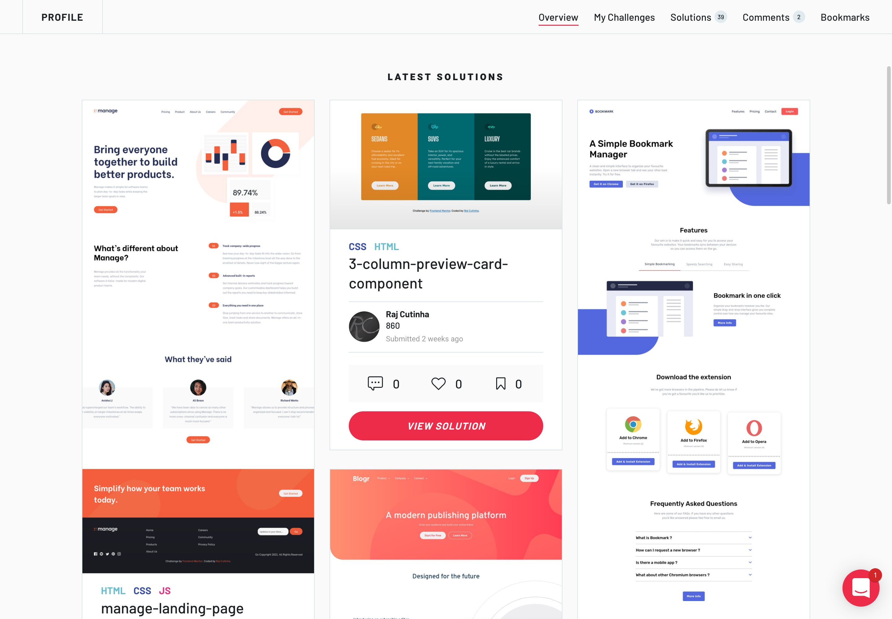

# Frontend Mentor Challenges

## Table of contents

### Frontend Mentor Challenges

- [Frontend Mentor Challenges](#frontend-mentor-challenges)
  - [Table of contents](#table-of-contents)
    - [Frontend Mentor Challenges](#frontend-mentor-challenges-1)
  - [Overview](#overview)
    - [Screenshot](#screenshot)
    - [The challenge](#the-challenge)
      - [Users should be able to:](#users-should-be-able-to)
    - [My process](#my-process)
    - [Built with](#built-with)
    - [What I learned](#what-i-learned)
    - [Useful resources](#useful-resources)
  - [Author](#author)

## Overview

On this Repository you can find all my Frontend Menter Challenges solutions. Frontend Mentor challenges help you improve your coding skills by building realistic projects.

### Screenshot

### The challenge

Build out the **Website/Application** close
to how the design looks from the provided Design Files

  
 
#### Users should be able to:
- View the optimal layout for the site depending on their device's screen size
- See hover states for all interactive elements on the pages

### My process

- Looking into the desgin Files provided by Frontend Mentor
- Thinking about the build process and breaking it down into smaller steps
- Thinking about how to structure the Project (What do i need ?)
- After the 3 previous steps i start my building
- If i get stuck i first go to the docs to find the answer myself
- If i dont find it myself i look on others solution and try to undertand how they have done it
- Still if i cant find the answer i continue searching up on YouTube. I never search for a full project. By breaking down the Project beforehand i just search for the component i have to build (like a image slider). I build it out and then i try to implement it into the projects.

### Built with

- Semantic HTML5 markup
- CSS custom properties
- Flexbox
- CSS Grid
- Responsive
- React - JS library

### What I learned

- How to structure a Project
- How to break down Projects into smaller steps
- How to search up for problems if i am stuck
- How to use GIT
- How to use APIS and how to handle Errors
- How to read Code from others
- How to build based on a Design File
- How to HOST simple Projects

### Useful resources

- [conquering-responsive-layouts](https://courses.kevinpowell.co/conquering-responsive-layouts) -

  I used to struggle with responsive Layouts.
  This is a 21-days challenge by Kevin Powell. In this free course he covers everything to get started with responsive Layouts.

- [Coding Addict](https://www.youtube.com/c/CodingAddict/featured)

  On this YouTube Channel you will find 10h Courses. He covers everything you need to know to complete the Projects.

- [Kevin Powell](https://www.youtube.com/channel/UCJZv4d5rbIKd4QHMPkcABCw)

  This Channel will bring your CSS skills on the next Level. I learned many hacky and advanced CSS from this Channel.

## Author

- Website - [Raj Cutinha](https://rajcutinha.netlify.app/index.html)
- Frontend Mentor - [@RajCutinha](https://www.frontendmentor.io/profile/RajCutinha)
- Twitter - [@CutinhaRaj](https://twitter.com/CutinhaRaj)
